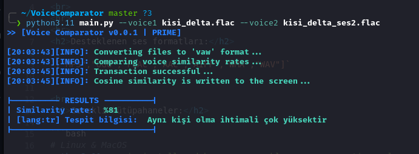
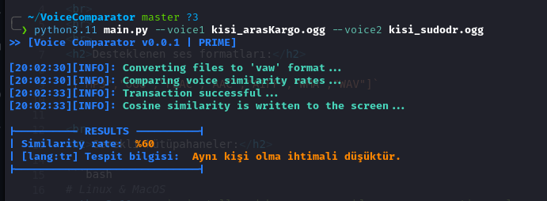

# VoiceComparator

<p>An educational tool in the field of computer forensics and osint to check whether existing voices belong to the same person. Based on the Python3 resemblyzer library, the tool analyzes sounds given in supported formats (albeit in very short periods of time), calculates their similarities using cosine similarity and gives the results..
<br>
<hr>
<br>
<h2>Supported audio formats:</h2>

`["MP3","OGG","FLAC","AAC","AIFF","WMA","WAV"]`


<br>
<h2>Required libraries:</h2> 

```bash
# Linux & MacOS
python3.11 -m pip install pydub numpy resemblyzer argparse time colorama

```

```bash
# Windows
pip install install pydub numpy resemblyzer argparse time colorama

```

<h2>Usage:</h2>
<br>
It is very simple to use after the necessary libraries are installed.

```bash
cd VoiceComparator
python3.11 main.py --voice1 denemeSes1.mp3 --voice2 denemeKisi2.ogg

```

<h2>Example:</h2>

### VOICE COMPARISON OF THE SAME PERSON:



<br>
<br>

### COMPARISON OF THE VOICES OF DIFFERENT PEOPLE:



<h2>Thanks </h2>
<br>
    Thanks for providing audio samples:<br>
<br>

<a href="https://t.me/sudodr"> `https://t.me/sudodr` </a><br>
<a href="https://t.me/araskargo_resmi"> `https://t.me/araskargo_resmi` </a> <br>
<a href="https://t.me/araskargo_resmi"> `https://t.me/setpassunlock`</a> <br>
</p>